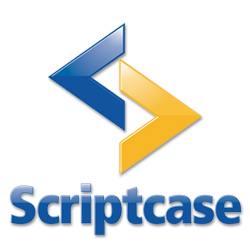

# CSMO Ambulatorial 

> Sistema de saúde ambulatórial desenvolvido durante estágio no Depart. de Gestão de Tecnologia da Informação (DGTI) do IFPE campus Recife para a Coordenação do Serviço Médico e Odontológico (CSMO) do mesmo campus.

## Necessidade

Todas as operações de registro e consulta do CSMO eram realizados através de fichas e cartões impressos. Com objetivo de reduzir o volume de papeis gastos nestas operações, bem como organziar e proteger as transações realizadas pela coordenação de saúde, foi solicitado ao DGTI um sistema que otimizasse estas questões.

## Ferramentas utilizadas

Para elaborar este sistema foi utilizado o Scriptcase v8.0, ambiente de desenvolvimento focado em PHP. Como ferramentas auxiliares foram utilizados Notepad++ e o XAMPP, para aprendizado da linguagem PHP. Também foram utilizados o GIMP para manipulação de imagens específicas, Visual Studio Code para manipulação e análise de arquivos HTML, Javascript e CSS, usados de forma auxiliar ao Scriptcase, além do Mozilla Firefox e Google Chrome para testes de compatibilidade entre navegadores.

## Banco de Dados

O SGBD  utilizado foi o MySQL, manipulado através do MySQL Workbench 6.3 CE tanto para elaborar o modelo relacional como criar o BD que comportará os dados do sistema. O código do BD encontra-se no diretório "\BD_CSMO". 

## Funcionalidades

O sistema possibilita:

* Cadastrar pacientes (Aluno, Servidor, Terceirizado ou Visitante);
* Consultar pacientes;
* Atualizar dados dos pacientes;
* Cadastrar usuários (Recepcionista, Aux. de Enfermagem., Enfermeira, Aux. de Dentista, Dentista, Médico, Gestor);
* Consultar dados do usuários;
* Cadastrar atendimento realizado;
* Consultar atendimento;
* Preencher prontuário (Dados do paciente, Triagem, Evolução médica, Conduta médica, Evolução odontológica, Conduta odontológica, Prescrição médica/odontológica, Registro de enfermagem);
* Preencher odontograma (Status do dente e das faces, Histórico do paciente e  Anotações);
* Emitir documentos (Atestados, Receituário, Declaração, Ficha de acompanhamento, Licença para tratamento e Licença de acompanhamento familiar);
* Alterar e-mail e senha dos usuários.

## Políticas de privacidade

### Adaptação

Os documentos emitidos tiveram seu layout original removidos para preservar o padrão da documentação Federal adotada pelas coordenações de saúde dos Institutos Federais. Em seu lugar é exibido um fundo branco para que seja possível demonstrar a funcionalidade da ferramenta.

### Sigilo de dados

Os campos de Evolução e Conduta, seja médica ou odontológica, são criptografados no BD para preservar o sigilo médico-paciente. A criptografia ocorre no próprio sistema, que em seguida armazena os dados em foram de letras e numeros aleatórios. De forma inversa, a decodificação também ocorre no sistema, ficando legível apenas nos campos mencionados acima.

## Agradecimentos

* Aos estagiários e colegas de equipe: Marcos Antonio Ferrreira da Silva Junior e Eduardo Pinto Feitosa da Silva Filho;
* Ao supervisor da equipe de Desenvolvimento, Victor Monte e ao estagiário de Redes, Edson Francisco de Andrade Junior;
* Ao responsável pelo Depart. de Gestão de Tecnologia da Informação, Tárcio Luna;
* E a todos os funcionários da Coordenação do Serviço Médico e Odontológico que estavam abertos a colaborar com a equipe de Desenvolvimento.
